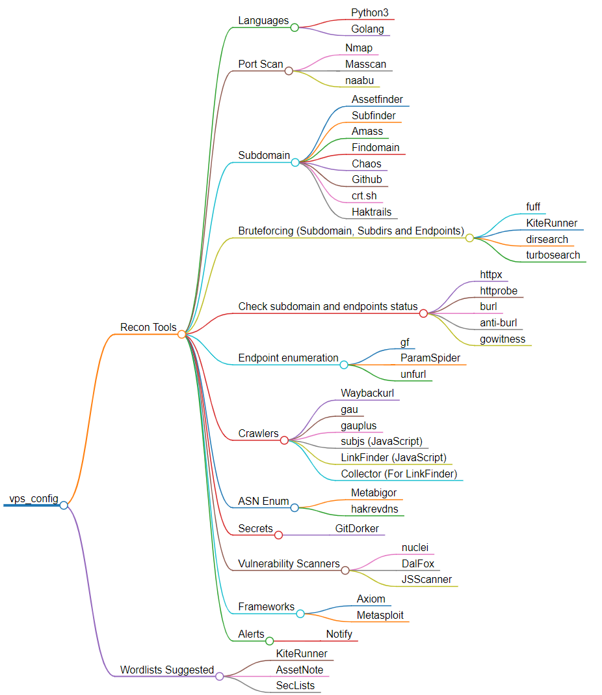

# vps_config
Simple script to prepare my VPSs. Feel free to contribute.




## Container usage

This Dockerfile installs the basic profile (run_basic.sh) in a Ubuntu lastest, find bellow some instructions:

```bash
docker build -t name_of_container .
docker run -v $(pwd):/workdir -it name_of_container bash #Linux

docker run -v ${PWD}:/workdir -it name_of_container bash #Windows
```

To execute it later do this:

```bash
docker ps -a
docker start "container_id"
docker exec -it <name_of_container or id> /bin/bash

```

If you want to run commands directly from container:

```bash
docker exec <name_of_container or id> ls /workdir

docker exec <name_of_container or id> nmap -V
```